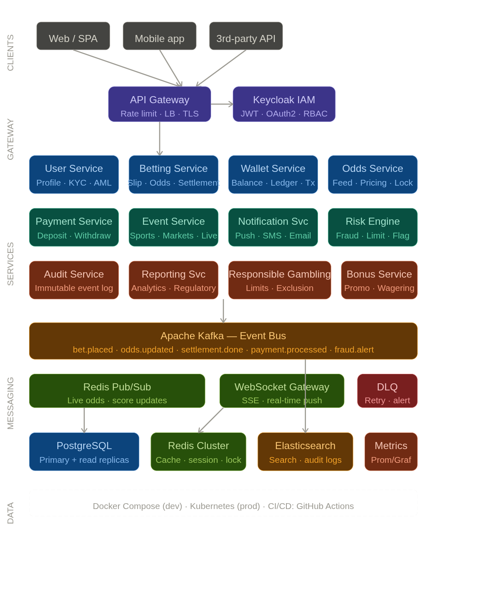

# EliteBet Platform

A production-grade, real-money sports betting platform built as a senior engineer portfolio project. EliteBet demonstrates distributed systems design, financial correctness, regulatory compliance, and operational maturity across a Java 21 + Spring Boot 3.x microservices architecture.

The system is modelled on UK Gambling Commission technical standards and EU PSD2 payment regulations. Every engineering decision — from the double-entry ledger to the transactional outbox — reflects patterns used in live fintech and gambling platforms.

---

## Why this project exists

Most portfolio projects demonstrate CRUD. EliteBet demonstrates the problems that actually separate senior engineers from mid-level ones: race conditions on concurrent wallet mutations, exactly-once Kafka event processing, odds locking under high concurrency, idempotent financial APIs, immutable audit trails, and GDPR-compliant data handling. If you want to understand every design decision, read the [Architecture Decision Records](#architecture-decision-records) below.

---

## Tech stack

| Layer | Technology |
|---|---|
| Language & Runtime | Java 21 (Project Loom virtual threads) |
| Framework | Spring Boot 3.3.x |
| Identity & Access | Keycloak 24 — OAuth2/OIDC, JWT RS256, RBAC |
| Primary Database | PostgreSQL 16 with Flyway migrations |
| Cache / Sessions / Locks | Redis 7 Cluster |
| Event Streaming | Apache Kafka 3.7 |
| Observability | Prometheus + Grafana, Jaeger (OpenTelemetry), structured JSON logs |
| Resilience | Resilience4j — circuit breaker, retry, bulkhead, rate limiter |
| API Documentation | Springdoc OpenAPI 3 (Swagger UI at `/swagger-ui.html`) |
| Testing | JUnit 5, Testcontainers, WireMock, ArchUnit, Spring Security Test |
| Containerisation | Docker + Docker Compose (dev), Kubernetes-ready |

---

## Services

The platform is decomposed into 15 independently deployable services. Each owns its own PostgreSQL schema, publishes and consumes Kafka events, and exposes a versioned REST API secured with Keycloak JWTs.

| Service | Port | Core responsibility |
|---|---|---|
| `api-gateway` | 8080 | Request routing, JWT pre-validation, rate limiting, TLS termination |
| `user-service` | 8081 | Registration, profile management, KYC/AML, GDPR |
| `auth-service` | 8082 | Keycloak adapter, token refresh, session lifecycle |
| `betting-service` | 8083 | Bet slip creation, odds locking, validation, slip lifecycle |
| `odds-service` | 8084 | External odds feed ingestion, pricing engine, Redis pub/sub |
| `wallet-service` | 8085 | Double-entry ledger, balance management, transaction history |
| `payment-service` | 8086 | Deposit and withdrawal gateway integration |
| `event-service` | 8087 | Sports events, markets, selections, result ingestion |
| `settlement-service` | 8088 | Bet settlement engine, void rules, dead heat, cash-out |
| `risk-service` | 8089 | Fraud scoring, liability caps, stake limit enforcement |
| `notification-service` | 8090 | WebSocket push, async email, SMS dispatch |
| `bonus-service` | 8091 | Promotions, free bets, wagering requirement tracking |
| `audit-service` | 8092 | Immutable append-only event log, GDPR erasure |
| `reporting-service` | 8093 | Analytics, regulatory reports, P&L summaries |
| `responsible-gambling-service` | 8094 | Deposit limits, session limits, self-exclusion, reality checks |

---

## Quick start

### Prerequisites

- Docker 24+ and Docker Compose v2
- Java 21 (for running services outside Docker)
- Maven 3.9+

### Run the full stack

```bash
git clone https://github.com/your-handle/EliteBet-platform.git
cd EliteBet-platform

# Start all infrastructure (PostgreSQL, Redis, Kafka, Keycloak, Jaeger, Grafana)
docker compose up -d

# Wait for Keycloak to finish booting (~30s), then run all services
./mvnw spring-boot:run -pl services/api-gateway &
./mvnw spring-boot:run -pl services/user-service &
./mvnw spring-boot:run -pl services/betting-service &
# ... or use the provided run-all.sh script
./scripts/run-all.sh
```

### Verify the stack is healthy

```bash
curl http://localhost:8080/actuator/health
# All services should report {"status":"UP"}
```

### Access developer tools

| Tool | URL |
|---|---|
| Swagger UI (API Gateway) | http://localhost:8080/swagger-ui.html |
| Keycloak Admin Console | http://localhost:9090/admin (admin / admin) |
| Grafana Dashboards | http://localhost:3000 (admin / admin) |
| Jaeger Tracing UI | http://localhost:16686 |
| Kafka UI | http://localhost:8070 |

### Get a test token

```bash
curl -s -X POST http://localhost:9090/realms/EliteBet/protocol/openid-connect/token \
  -d "grant_type=password&client_id=EliteBet-client&username=testbettor&password=password" \
  | jq -r '.access_token'
```

Paste that token into Swagger UI's Authorize dialog to explore the full API.

---

## Placing a bet — end-to-end walkthrough

This sequence touches six services and illustrates the core flow.

1. **Client** sends `POST /api/v1/bets` with a JWT, stake amount, and list of selections.
2. **API Gateway** validates the JWT against Keycloak's JWKS endpoint and forwards the request.
3. **Betting Service** calls Responsible Gambling Service to check the user isn't self-excluded and hasn't exceeded stake limits. If the check fails, the request is rejected immediately with `423 BET_NOT_PERMITTED`.
4. **Betting Service** reads current odds for each selection from Redis (populated by Odds Service). The odds are locked at this instant and written to the `BetSlip`. If any selection's odds have moved since the client last fetched them, the service returns `409 ODDS_CHANGED` with the new odds — the client must resubmit.
5. **Wallet Service** is called to freeze the stake amount using optimistic locking (`@Version` on the `Wallet` entity). On a concurrent write conflict it retries up to three times, then returns `409 CONCURRENT_MODIFICATION`.
6. The `BetSlip` is persisted as `ACCEPTED` and an `outbox` record is written in the same DB transaction. A background poller publishes `bet.placed` to Kafka within 100ms.
7. **Risk Service** consumes `bet.placed`, runs a fraud score, and emits `fraud.alert` to Kafka if thresholds are exceeded — which triggers an automatic account review without blocking the original response.
8. **Notification Service** consumes `bet.accepted` and pushes a real-time confirmation over WebSocket.

The user receives an HTTP 201 with the accepted slip in under 200ms. Settlement happens asynchronously when the event result arrives.

---

## Key engineering decisions

### All monetary values are stored as `long` (minor units)

Floating-point arithmetic is unsuitable for financial calculations. `£10.50` is stored as `1050L` (pence). This eliminates rounding errors entirely and makes arithmetic in all languages exact. A custom Jackson serialiser formats amounts for API responses.

### Double-entry ledger — never mutate a balance directly

The `Wallet` entity has no `setBalance()` method visible to the application layer. Every financial movement creates a `LedgerEntry` (debit or credit) and the balance is derived. This means every penny is traceable, reversible, and auditable. It also means the books always balance: the sum of all credits equals the sum of all debits across the system.

### Transactional outbox pattern for Kafka publishing

Calling `kafkaTemplate.send()` inside a `@Transactional` method creates a dual-write problem: if the DB commits but Kafka is unavailable, the event is lost forever. EliteBet solves this with an outbox table. The event is written to the DB atomically with the business data, and a separate poller publishes it to Kafka once both the DB commit and Kafka delivery succeed. This guarantees at-least-once delivery with no data loss.

### Idempotent Kafka consumers

Because Kafka delivery is at-least-once, every `@KafkaListener` checks a `processed_events` table before acting. If the `eventId` is already there, the consumer logs and returns — the operation is a no-op. The insert into `processed_events` happens inside the same DB transaction as the business operation, making the consumer idempotent by construction.

### Optimistic locking on Wallet, not pessimistic

The wallet is read far more often than it is written. Pessimistic locking would serialise all reads unnecessarily. Optimistic locking adds zero overhead for the common case (no contention) and handles conflicts gracefully at the application layer with a retry loop. Distributed Redis locks are reserved for operations where optimistic retry is inappropriate — specifically, bet settlement, where a duplicate settlement could credit a user twice.

### Virtual threads over reactive programming

Java 21 virtual threads deliver the same non-blocking I/O scalability as Spring WebFlux, but with imperative code that is straightforward to read, test, and debug. Reactive programming is used only in the Odds Service, where the backpressure model genuinely improves handling of the high-volume external odds feed.

### Kafka over RabbitMQ

Kafka's log retention is the deciding factor. Audit log replay, settlement reprocessing, and fraud investigation all require the ability to re-read historical events. RabbitMQ deletes messages after consumption. Kafka's partitioning by `userId` also provides natural ordering guarantees for a given user's events, which matters for settlement and ledger consistency.

---

## Security model

Authentication is handled entirely by Keycloak. Services are stateless resource servers that validate JWTs on every request against Keycloak's JWKS endpoint. There are no session cookies.

Four RBAC roles are defined: `BETTOR` (regular user), `OPERATOR` (trading desk, can suspend markets), `COMPLIANCE_OFFICER` (can approve withdrawals, run AML reports), and `ADMIN` (full access). Every controller method and service method carries a `@PreAuthorize` annotation — there is no implicit access anywhere in the codebase.

Additional controls: Redis token bucket rate limiting at the gateway (10 bets/second per user, 5 login attempts per 15 minutes), AES-256-GCM encryption at rest for KYC document paths and payment tokens, and a custom Logback filter that redacts PII patterns (email addresses, card numbers) from all log output.

---

## Responsible gambling & compliance

Self-exclusion is synchronous and immediate. When a user submits a self-exclusion request, their account status is set to `EXCLUDED` in the same HTTP request cycle, all active Keycloak sessions are invalidated via the admin API, and a `user.self-excluded` Kafka event cascades to every service before the response is returned. A self-excluded user cannot place bets, make deposits, or claim bonuses from that moment forward.

Withdrawals above £2,000/day are subject to a mandatory 24-hour server-side cooling-off period. Withdrawals above £10,000 require dual approval from a `COMPLIANCE_OFFICER`. These thresholds are configurable via environment variables.

The audit log is an append-only PostgreSQL table enforced at the database level with a `CREATE RULE` that discards any `UPDATE` or `DELETE` against it. The application layer further enforces this: `AuditLogRepository` exposes only an `insert()` method.

GDPR erasure anonymises PII fields (`email`, `phone`, `name`, `address`) to a deterministic hash of the user ID. Financial records are retained for seven years as required by UK law, with a regulatory hold flag preventing their deletion.

---

## Testing approach

Every service has three test layers. Unit tests cover all service-layer business logic in isolation with JUnit 5 and Mockito, targeting ≥80% line coverage enforced by JaCoCo in CI. Integration tests use Testcontainers to spin up real PostgreSQL, Redis, and Kafka instances — no mocking of infrastructure. All external HTTP services (payment gateway, KYC provider, odds feed) are stubbed with WireMock. Architecture tests use ArchUnit to enforce structural rules: services do not import each other's code, domain classes do not reach into infrastructure, and no service-layer method is missing a `@PreAuthorize` annotation.

The most important tests are the concurrency tests in `BettingServiceConcurrencyTest` and `WalletServiceConcurrencyTest`. These spin up 50 threads simultaneously and assert: no duplicate slips, no negative balances, all ledger entries balanced, and no lost updates under optimistic lock contention.

---

## Architecture Decision Records

Full ADRs are in `/docs/adr/`. Summaries:

- **ADR-001** — Kafka over RabbitMQ: log retention and event replay capability.
- **ADR-002** — Transactional outbox over direct Kafka publish: eliminates the dual-write problem.
- **ADR-003** — Optimistic over pessimistic locking for Wallet: better throughput under typical read-heavy load.
- **ADR-004** — Redis Redisson RedLock for settlement: prevents duplicate settlement of the same slip.
- **ADR-005** — Virtual threads over reactive: equivalent scalability with dramatically simpler code.

---

## Non-functional targets

| Metric | Target |
|---|---|
| Bet placement p99 latency | < 200ms |
| Odds feed update p99 latency | < 50ms |
| Peak throughput | 500 bet placements / second |
| Concurrent users | 10,000 |
| Availability | 99.95% (≤ 4.4 hours downtime / year) |
| Financial data durability | Zero loss (Kafka replication factor 3, PostgreSQL synchronous replication) |

---

## Running tests

```bash
# Unit tests only (fast, no Docker required)
./mvnw test -pl services/betting-service

# Integration tests (requires Docker for Testcontainers)
./mvnw verify -pl services/betting-service -P integration-tests

# Full suite across all services
./mvnw verify

# Architecture tests only
./mvnw test -Dtest="*ArchitectureTest" -pl services/betting-service
```

---

## Environment variables

Each service is configured entirely through environment variables. A `.env.example` file at the root documents every variable. Key ones:

| Variable | Description |
|---|---|
| `KEYCLOAK_ISSUER_URI` | Keycloak realm URL for JWT validation |
| `SPRING_DATASOURCE_URL` | PostgreSQL connection string |
| `SPRING_REDIS_HOST` | Redis host |
| `SPRING_KAFKA_BOOTSTRAP_SERVERS` | Kafka broker list |
| `ENCRYPTION_KEY` | AES-256 key for field-level encryption (base64) |
| `WITHDRAWAL_DAILY_LIMIT` | Daily withdrawal threshold before cooling-off (minor units) |
| `WITHDRAWAL_COMPLIANCE_LIMIT` | Withdrawal amount requiring dual approval (minor units) |

---

## Licence

MIT — use this freely as a reference or starting point. If it helps you land a role, a GitHub star is appreciated.